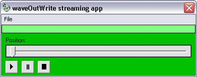



## Waveplayer using the waveOutWrite method instead of other cheap functions\!\!

### Description

This is a Waveplayer with plays wave audio with the waveOutWrite function instead of using other cheap functions like the (PlaySound) one.

This is the more C++ way to do it, and it also supports larger files al well!!
 
### More Info
 

             |
---                |---
**Submitted On**   |2002-01-21 12:31:42
**By**             |[Peter Hebels](https://github.com/Planet-Source-Code/PSCIndex/blob/master/ByAuthor/peter-hebels.md)
**Level**          |Advanced
**User Rating**    |5.0 (20 globes from 4 users)
**Compatibility**  |VB 6\.0
**Category**       |[Sound/MP3](https://github.com/Planet-Source-Code/PSCIndex/blob/master/ByCategory/sound-mp3__1-45.md)
**World**          |[Visual Basic](https://github.com/Planet-Source-Code/PSCIndex/blob/master/ByWorld/visual-basic.md)
**Archive File**   |[Waveplayer502931212002\.zip](https://github.com/Planet-Source-Code/peter-hebels-waveplayer-using-the-waveoutwrite-method-instead-of-other-cheap-functions__1-31049/archive/master.zip)

